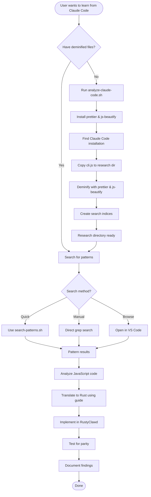
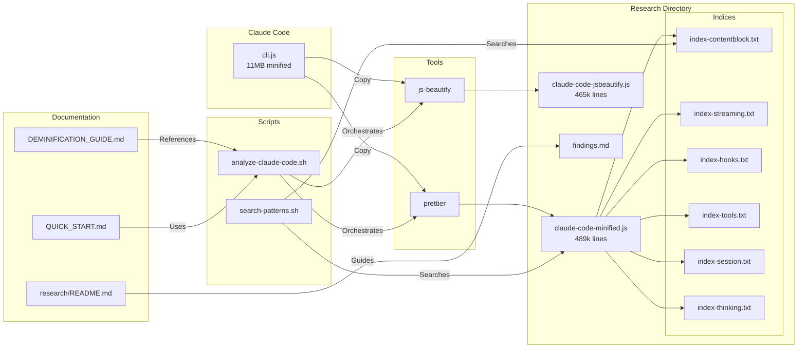
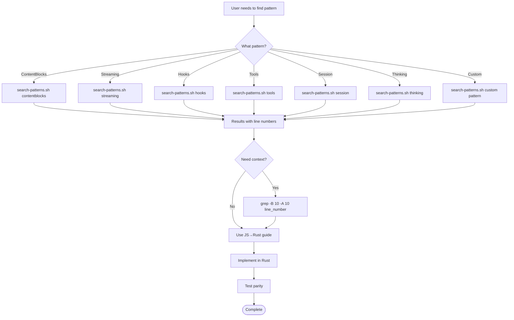
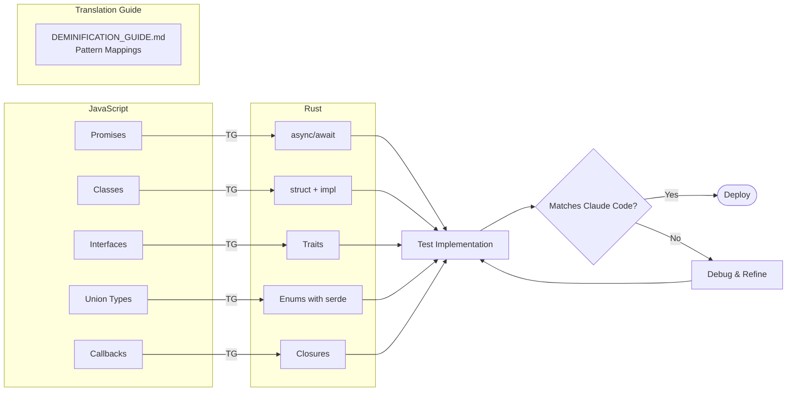
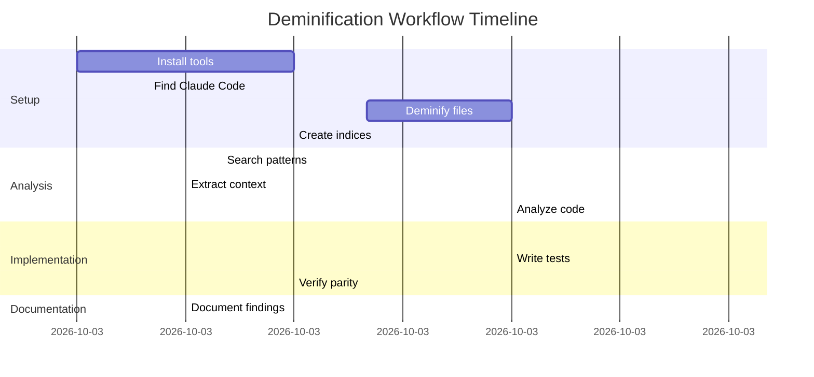
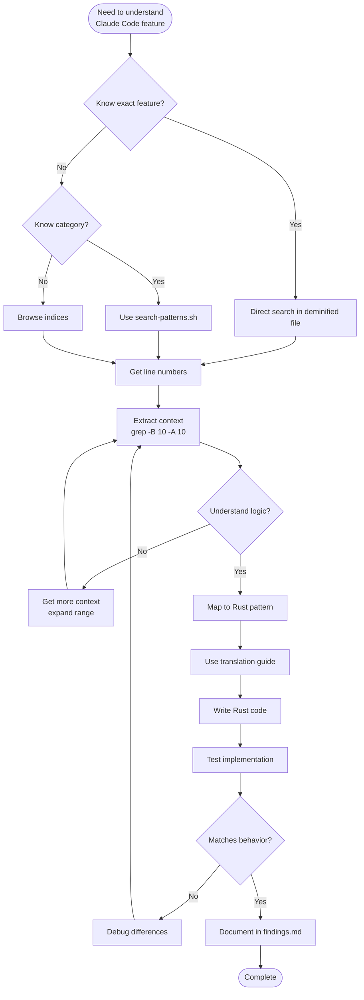
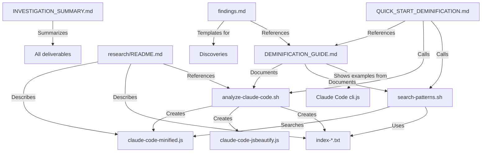
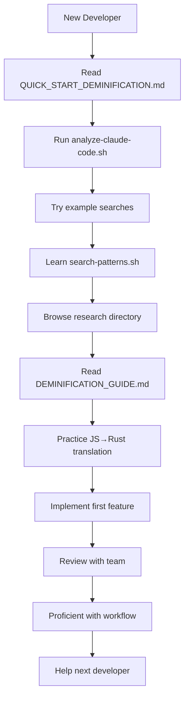

# Claude Code Deminification Workflow Diagram

## Overview Flowchart

## Component Architecture

## Search Pattern Flow

## JavaScript to Rust Translation Pipeline

## Usage Timeline

## Pattern Search Decision Tree

## File Dependency Graph

## Team Onboarding Flow

## Legend

### Symbols
- 📄 Document
- 🔧 Script/Tool
- 📁 Directory
- 🔍 Search Operation
- ⚙️ Process
- ✅ Deliverable
- 🎯 Goal

### Color Coding
- **Green**: Completed/Success
- **Blue**: Process/Action
- **Orange**: Decision Point
- **Red**: Error/Debug
- **Gray**: Reference/Documentation

## Usage Guide

### How to Use These Diagrams

1. **Overview Flowchart**: Shows complete workflow from start to finish
2. **Component Architecture**: Shows file relationships and dependencies
3. **Search Pattern Flow**: Guides through pattern search process
4. **Translation Pipeline**: Maps JavaScript patterns to Rust
5. **Usage Timeline**: Shows time estimates for each phase
6. **Decision Tree**: Helps choose right search approach
7. **Dependency Graph**: Shows document relationships
8. **Onboarding Flow**: Guides new team members

### Quick Reference

| Need | Use This Diagram |
|------|------------------|
| Starting out | Overview Flowchart |
| Understanding files | Component Architecture |
| Searching patterns | Search Pattern Flow |
| Translating code | Translation Pipeline |
| Time planning | Usage Timeline |
| Choosing method | Decision Tree |
| Finding docs | Dependency Graph |
| Onboarding | Team Onboarding Flow |

## Mermaid Rendering

These diagrams use Mermaid syntax. To view them:

1. **GitHub**: Renders automatically in markdown
2. **VS Code**: Install "Markdown Preview Mermaid Support" extension
3. **Online**: Use [mermaid.live](https://mermaid.live) editor
4. **CLI**: Use `mmdc` command from `@mermaid-js/mermaid-cli`

## Updating Diagrams

When workflow changes:

1. Update relevant diagram in this file
2. Test rendering in VS Code or GitHub
3. Update corresponding documentation
4. Commit with clear message about changes

## Additional Resources

- [Mermaid Documentation](https://mermaid.js.org/)
- [Flowchart Syntax](https://mermaid.js.org/syntax/flowchart.html)
- [Gantt Charts](https://mermaid.js.org/syntax/gantt.html)
